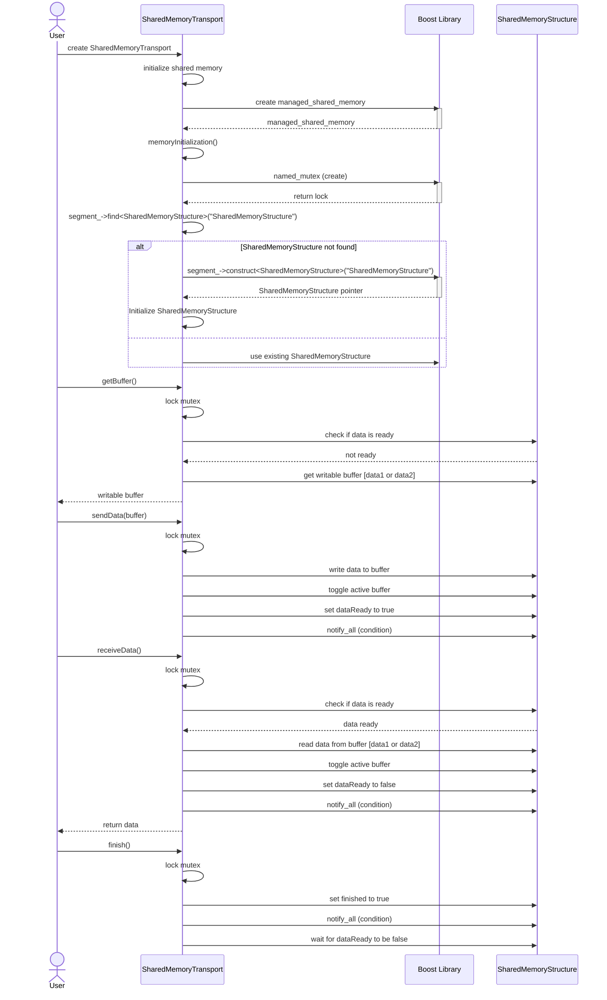

## Sequince diagram

```mermaid
sequenceDiagram
    actor User

    participant SMT as SharedMemoryTransport
    participant BL as Boost Library
    participant SMS as SharedMemoryStructure

    User ->> SMT: create SharedMemoryTransport
    SMT ->> SMT: initialize shared memory
    SMT ->> BL: create managed_shared_memory
    activate BL
    BL -->> SMT: managed_shared_memory
    deactivate BL
    SMT ->> SMT: memoryInitialization()
    SMT ->> BL: named_mutex (create)
    activate BL
    BL -->> SMT: return lock
    deactivate BL
    SMT ->> SMT: segment_->find<SharedMemoryStructure>("SharedMemoryStructure")

    alt SharedMemoryStructure not found
      SMT ->> BL: segment_->construct<SharedMemoryStructure>("SharedMemoryStructure")
      activate BL
      BL -->> SMT: SharedMemoryStructure pointer
      deactivate BL
      SMT ->> SMT: Initialize SharedMemoryStructure
    else
      SMT ->> BL: use existing SharedMemoryStructure
    end

    User ->> SMT: getBuffer()
    SMT ->> SMT: lock mutex
    SMT ->> SMS: check if data is ready
    SMS -->> SMT: not ready
    SMT ->> SMS: get writable buffer [data1 or data2]
    SMT -->> User: writable buffer

    User ->> SMT: sendData(buffer)
    SMT ->> SMT: lock mutex
    SMT ->> SMS: write data to buffer
    SMT ->> SMS: toggle active buffer
    SMT ->> SMS: set dataReady to true
    SMT ->> SMS: notify_all (condition)

    User ->> SMT: receiveData()
    SMT ->> SMT: lock mutex
    SMT ->> SMS: check if data is ready
    SMS -->> SMT: data ready
    SMT ->> SMS: read data from buffer [data1 or data2]
    SMT ->> SMS: toggle active buffer
    SMT ->> SMS: set dataReady to false
    SMT ->> SMS: notify_all (condition)
    SMT -->> User: return data

    User ->> SMT: finish()
    SMT ->> SMT: lock mutex
    SMT ->> SMS: set finished to true
    SMT ->> SMS: notify_all (condition)
    SMT ->> SMS: wait for dataReady to be false
```