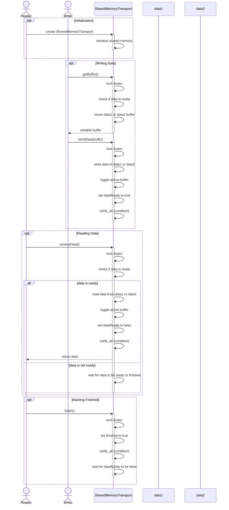

## Sequince diagram

```mermaid
sequenceDiagram
    actor Reader
    actor Writer

    participant SMT as SharedMemoryTransport
    participant data1
    participant data2

    opt Initialization
        Reader ->> SMT: create SharedMemoryTransport
        activate SMT
        SMT ->> SMT: initialize shared memory
        deactivate SMT
    end

    opt Writing Data
        Writer ->> SMT: getBuffer()
        activate SMT
        SMT ->> SMT: lock mutex
        SMT ->> SMT: check if data is ready
        SMT ->> SMT: return data1 or data2 buffer
        SMT -->> Writer: writable buffer
        deactivate SMT

        Writer ->> SMT: sendData(buffer)
        activate SMT
        SMT ->> SMT: lock mutex
        SMT ->> SMT: write data to data1 or data2
        SMT ->> SMT: toggle active buffer
        SMT ->> SMT: set dataReady to true
        SMT ->> SMT: notify_all (condition)
        deactivate SMT
    end

    opt Reading Data
        Reader ->> SMT: receiveData()
        activate SMT
        SMT ->> SMT: lock mutex
        SMT ->> SMT: check if data is ready
        alt data is ready
            SMT ->> SMT: read data from data1 or data2
            SMT ->> SMT: toggle active buffer
            SMT ->> SMT: set dataReady to false
            SMT ->> SMT: notify_all (condition)
            SMT -->> Reader: return data
        else data is not ready
            SMT ->> SMT: wait for data to be ready or finished
        end
        deactivate SMT
    end

    opt Marking Finished
        Reader ->> SMT: finish()
        activate SMT
        SMT ->> SMT: lock mutex
        SMT ->> SMT: set finished to true
        SMT ->> SMT: notify_all (condition)
        SMT ->> SMT: wait for dataReady to be false
        deactivate SMT
    end
```